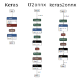

# Keras - Conv1D conversions with tf2onnx and keras2onnx do not support NWC layout for Conv1D (Keras default)

## Support for Conv1D NWC kernel (keras default)

I did not find a way to avoid a transposition layer before and after the Conv1D operator and support the NWC kernel
One solution I tried was the parameter inputs_as_nchw="args_0", but that also failed. How can I proceed?

I add some code to clarify my point further. 
As an example we use the following keras model:

~~~
def get_conv1d_flatten_dense():
    model_input = tf.keras.layers.Input(shape=(10,6),batch_size=1)
    l1 = tf.keras.layers.Conv1D(5,3, activation="relu")
    l2 = tf.keras.layers.Flatten()
    model_output = tf.keras.layers.Dense(2, use_bias=False)
    return tf.keras.models.Sequential([model_input,l1,l2,model_output])
~~~

## keras2onnx and tfonnx compatibility

As mentioned in [github/keras-onnx](https://github.com/onnx/keras-onnx) we expected to achieve compatible results from tf2onnx and keras2onnx. 
That is true for Conv1D in the sense that we get models that produce numerically equal results, but not on a graph-topological level.

- keras2onnx converts Conv1D to Conv with 1d properties and 3 dimensional weights.
- tf2onnx converts Conv1d to Conv with 2d properties.

tf2onnx unsqueezes the first axis:

~~~
model_proto, external_tensor_storage = tf2onnx.convert.from_keras(
                model, 
                input_signature=(tf.TensorSpec(model.input_shape,dtype=tf.dtypes.float32, name=None),), opset=None, custom_ops=None,
                custom_op_handlers=None, custom_rewriter=None,
                inputs_as_nchw="args_0", extra_opset=None, shape_override=None,
                target=None, large_model=False, output_path=None)
model_proto
~~~
3.8.10 results in 9 layers  (see figure above.) 
The first layer actually converts the 2-dimensional input [timesteps, channels] into a 3-dimensional structure. The resulting model looks like this:

~~~
node 0 optype: Unsqueeze, axis: ['1']
node 1 optype: Transpose, axis: ['1']
node 2 optype: Conv
node 2 kernel_shape: ['1', '3']
node 2 weight shape: "sequential/conv1d/conv1d/ExpandDims_1:0": ['5', '6', '1', '3']
~~~

## keras2onnx converts Conv1D as Conv with Conv1D properties

~~~
model_proto = keras2onnx.convert_keras(model, "my_conv1d_flatten_dense")
model_proto
~~~

Results in 7 layers (see figure above) with:

~~~
node 0 optype: Transpose, axis: ['0', '2', '1']
node 1 optype: Conv, kernel_shape {'name': 'group', 'i': '1', 'type': 'INT'}
node 1 weight shape "conv1d/kernel:0": ['5', '6', '3']
~~~

## Remark

My original intention to use tf2onnx was to get rid of the suboptimal NCW default configuration for keras2onnx since Keras defines Conv1D as default "channel_last" or as NWC. 
But finally even that could not be resolved.

[Code](conv1d_issue_tf2onnx.py) python package versions are mentioned in the first section

-----
Contact

[tf2onnx](https://github.com/onnx/tensorflow-onnx)
